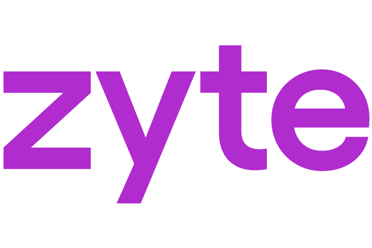

<p align="center">
	
</p>

<h1 align="center">Zyte Web Data</h1>

<p align="center">
	From a plain-English prompt to a working Scrapy spider.
</p>

<p align="center">
	<a href="https://github.com/zytedata/skills/releases/tag/0.2.0">
		
	</a>
	<a href="https://github.com/zytedata/skills/blob/main/LICENSE.md">
		
	</a>
	<a href="https://skills.sh/zytedata/skills">
		
	</a>
	<a href="https://github.com/zytedata/skills">
		
	</a>
</p>

---

> Using a specific coding agent? See [Zyte Coding Agent Add-Ons](https://docs.zyte.com/ai-code.html) for alternatives.

## Install

```bash
npx skills add zytedata/skills
```

The `skills` CLI installs skills for supported agents. See [skills.sh](https://www.skills.sh) for the list of supported agents and how to enable skills in each.

---

## What it does

This is Zyte's official [skills.sh](https://www.skills.sh) plugin that generates production-ready [Scrapy](https://scrapy.org) spiders with [web-poet](https://web-poet.readthedocs.io) page objects from a plain-English prompt. Give it a URL and describe what you want to extract. It handles site exploration, schema discovery, code generation, and smoke testing: no boilerplate, no manual selector hunting.

The plugin explores the target site, discovers available fields, and presents a schema for your approval before generating a single line of code. After you confirm the schema, it creates a Scrapy project with all dependencies configured, generates web-poet page objects and test fixtures, wires up the spider, and runs a smoke test to verify that extraction is working before handing the project back to you.

Optionally, use `/scrape-scrapy-cloud` to deploy directly to [Scrapy Cloud](https://www.zyte.com/scrapy-cloud/) for scheduled runs, job history, and monitoring. A [free tier is available](https://docs.zyte.com/scrapy-cloud/pricing.md).

---

## Use cases

The `/scrape` skill works on any website with repeating structured content: detail pages linked from a listing or category page. Examples from the skill:

- Product catalogs
- Job listings
- Recipes

---

## How does it work?

The `/scrape` skill orchestrates five stages automatically:

```
1. Decide which fields to extract   →  /scrape-define
2. Analyze the website              →  /scrape-spec
3. Create the Scrapy project        →  /scrape-ensure-project
4. Generate the extraction code     →  /scrape-codegen
5. Generate the spider              →  /scrape-create-spider
```

Each stage feeds directly into the next. When the pipeline completes, you have a runnable spider and a passing test suite:

```bash
uv run scrapy crawl <spider_name>
uv run pytest fixtures/
```

---

## Skills

### Orchestration

| Skill | Description |
|---|---|
| `scrape` | End-to-end web scraping workflow — from URL to working spider with web-poet page objects |

### Pipeline stages (called automatically by `/scrape`)

| Skill | Description |
|---|---|
| `scrape-define` | Quick schema definition: explore one detail page, discover fields, fast approval loop |
| `scrape-spec` | Explore diverse pages and validate the extraction spec: downloads pages, compares variants, optional browser review |
| `scrape-explore-site` | Explore a website to find and save diverse pages (start, list, detail) with classified links |
| `scrape-analyze-page` | Extract all available fields with values from a detail page |
| `scrape-ensure-project` | Ensure a Scrapy project exists with scrapy-poet and Zyte API support |
| `scrape-codegen` | Generate web-poet page object code from an extraction spec |
| `scrape-codegen-analyze` | Analyze an HTML page to produce field extraction instructions for code generation |
| `scrape-codegen-generate` | Generate web-poet page object code from per-page extraction analyses |
| `scrape-create-spider` | Generate a Scrapy spider that wires page objects together |

### Utilities

| Skill | Description |
|---|---|
| `scrape-add-page-object` | Add an empty web-poet page object to a Scrapy project |
| `scrape-review-schema` | Generate an HTML review page for schema and extracted data verification |

### Deployment

| Skill | Description |
|---|---|
| `scrape-scrapy-cloud` | Deploy projects, schedule spiders, list/stop jobs, and view items or logs on [Scrapy Cloud](https://www.zyte.com/scrapy-cloud/) |
| `scrape-zyte-login` | Set up your Zyte account and credentials |

---

## Prerequisites

- [skills.sh](https://www.skills.sh)
- [`uv`](https://docs.astral.sh/uv/) — used to create and manage the Scrapy project

Project dependencies (scrapy, scrapy-poet, scrapy-zyte-api, web-poet, extruct, price-parser, pytest) are installed automatically by the skills.

---

## Quickstart

Any scraping prompt triggers the skill automatically. For example:

```
Scrape books.toscrape.com
```

The plugin walks you through schema approval interactively, then generates a complete, tested Scrapy project.

---

## Update

To update:

```bash
npx skills update zytedata/skills
```

---

## Evaluation

We automatically evaluate skills and track both wall time and cost. We measure and aim to improve these metrics over time.

---

## Feedback

If you find any issue — such as prompts that did not work as expected, or that caused excessive wall time or cost — please [open a GitHub issue](https://github.com/zytedata/skills/issues).

Provide as much detail as possible to help us reproduce the issue. You are welcome to anonymize target websites or other data.

---

## Frequently asked questions

### Is a Zyte account required?

No. The generated spider is a standard Scrapy project that runs locally with `uv`. A Zyte account is required only if you want to deploy to [Scrapy Cloud](https://www.zyte.com/scrapy-cloud/) or use [Zyte API](https://www.zyte.com/zyte-api/) to access sites that block standard scrapers. If you want to use Zyte API, you'll need an account to generate an API key.

### Does it handle JavaScript-rendered pages?

The generated project includes `scrapy-zyte-api` as a dependency. Enabling headless browser rendering requires a [Zyte API](https://www.zyte.com/zyte-api/) key. The `/scrape-zyte-login` skill guides you through setting up your credentials.

### What Python libraries does the generated project use?

The project template includes `scrapy`, `scrapy-poet`, `scrapy-zyte-api`, `web-poet`, `extruct`, `price-parser`, and `pytest`. All dependencies are installed automatically via `uv sync`.

### Can the generated spider run without my AI coding agent?

Yes. The plugin generates a standard Scrapy project. Run it directly with:

```bash
uv run scrapy crawl <spider_name>
```

You can extend, modify, and deploy it independently of your AI coding agent.

---

## License

See [LICENSE.md](LICENSE.md) for the Zyte End User License Agreement.
